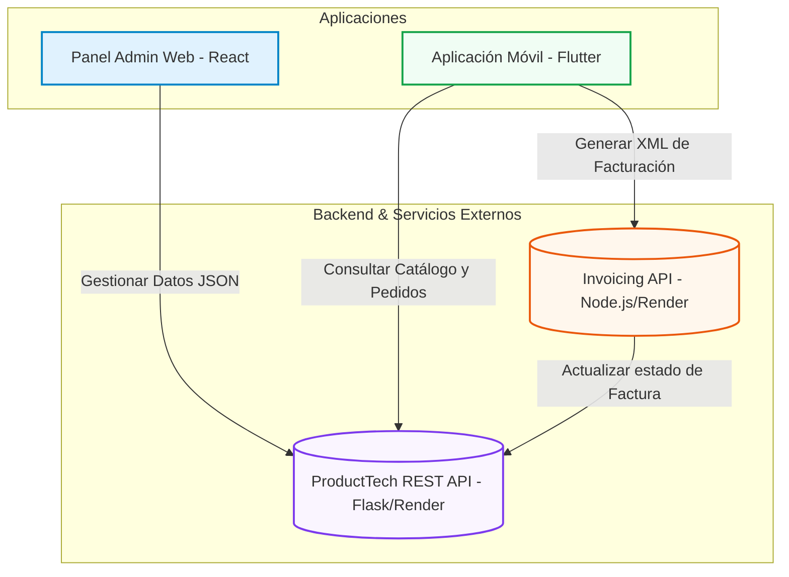

# 💻 TechStore System (ProductTech)

Bienvenido al repositorio central de **TechStore**, una solución integral de comercio electrónico y administración de tecnología. Este sistema multiplataforma está diseñado para ofrecer una experiencia fluida tanto a los administradores del negocio como a los clientes finales.

El repositorio se compone de dos aplicaciones principales que interactúan a través de servicios RESTful:
1. **`proyecto_final`**: Un panel de administración web moderno para la gestión del catálogo, clientes y transacciones.
2. **`vent_productos`**: Una aplicación móvil orientada al usuario final para la compra de dispositivos tecnológicos y consulta de pedidos.

---

## 📐 Arquitectura del Sistema

El siguiente diagrama ilustra cómo interactúan los componentes del ecosistema TechStore:



---

## 📦 Componentes del Proyecto

### 1. 🖥️ Panel de Administración Web (`proyecto_final`)
Este es el portal administrativo de **TechStore**. Permite a los administradores gestionar los recursos de la plataforma de manera eficiente y en tiempo real.

* **Stack Tecnológico**:
  * **React 19 & TypeScript**: Interfaz reactiva y tipado seguro.
  * **Vite**: Constructor de desarrollo ultra-rápido.
  * **Tailwind CSS v4**: Framework de estilos para un diseño moderno y responsivo.
  * **React Router 7**: Gestión avanzada de rutas y vistas.
  * **Axios**: Cliente HTTP para interactuar con la API.
  * **Lucide React**: Biblioteca de iconos estilizados y minimalistas.
  
* **Características Principales**:
  * 🔐 **Autenticación**: Inicio de sesión seguro para administradores.
  * 📊 **Dashboard**: Resumen visual con métricas clave del negocio.
  * 👥 **Gestión de Usuarios**: Control y visualización de cuentas registradas en el sistema.
  * 📦 **Gestión de Productos**: Altas, bajas (borrado lógico), modificaciones y control de stock.
  * 🛒 **Historial de Compras**: Registro completo y monitoreo de las transacciones realizadas.

---

### 2. 📱 Aplicación Móvil de Ventas (`vent_productos`)
La aplicación móvil está enfocada en el cliente, permitiéndole navegar por el catálogo y realizar compras directamente desde su smartphone.

* **Stack Tecnológico**:
  * **Flutter & Dart**: Desarrollo multiplataforma con alto rendimiento nativo.
  * **Provider**: Gestor de estado para manejar la autenticación del usuario y el carrito de compras persistente.
  * **HTTP**: Integración directa con los servicios REST.
  * **Google Nav Bar**: Barra de navegación moderna y ergonómica.
  * **Flutter Map & LatLong2**: Integración de mapas para la geolocalización o envíos.

* **Características Principales**:
  * 🔐 **Login de Clientes**: Autenticación integrada con la API.
  * 🛍️ **Catálogo de Dispositivos**: Lista interactiva de productos disponibles con filtros.
  * 🛒 **Carrito de Compras**: Añadir, quitar e incrementar cantidad de artículos dinámicamente.
  * 🧾 **Proceso de Compra**: Generación del pedido con selección de cliente o "Consumidor Final".
  * 🔌 **Facturación Electrónica**: Envío de información de pago al servicio externo de facturación para generar el comprobante XML oficial y actualizar automáticamente el estado del pedido a `FACTURADA`.

---

## 🔗 APIs de Integración

El sistema consume servicios en la nube alojados en **Render**:
* **API Principal (Catálogo y Gestión)**: `https://techstore-flask-api.onrender.com/`
* **API de Facturación Externa (Generación XML)**: `https://invoicing-rest-api-c6wh.onrender.com/api/factura`

---

## 🚀 Guía de Inicio Rápido

### Requisitos Previos
* **Node.js** (versión 18 o superior recomendada)
* **Flutter SDK** (versión 3.10 o superior) y **Dart**

---

### 🛠️ Configuración y Ejecución del Panel Web (`proyecto_final`)

1. Navega al directorio del frontend:
   ```bash
   cd proyecto_final
   ```

2. Instala las dependencias del proyecto:
   ```bash
   npm install
   ```

3. Inicia el servidor de desarrollo local:
   ```bash
   npm run dev
   ```

4. Abre el navegador web en: `http://localhost:5173/`

---

### 🛠️ Configuración y Ejecución de la App Móvil (`vent_productos`)

1. Navega al directorio de la aplicación móvil:
   ```bash
   cd vent_productos
   ```

2. Obtén los paquetes de Flutter necesarios:
   ```bash
   flutter pub get
   ```

3. Ejecuta la aplicación en un emulador o dispositivo físico conectado:
   ```bash
   flutter run
   ```

---

## 👥 Contribuidores
* **Josu Fiallos**
* **Marlon Guevara (MarlonKuna26)**
* **Steeven Toala**
